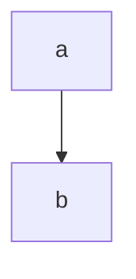

import { Preview } from "@/components/preview"

## Source

The component uses

- https://mermaid.js.org/
- https://www.npmjs.com/package/react-inlinesvg

## example

<Preview>
  <Mermaid
    content={`
        graph TB
        a-->b
      `}
  />
</Preview>

### Alternative via markdown syntax

````



````

## Flowchart

<Preview>
    <Mermaid
      content={`
        flowchart LR
          markdown["\`This **is**  _Markdown_\`"]
          newLines["\`Line1
          Line 2
          Line 3\`"]
          markdown --> newLines
      `}
    />

</Preview>

## Journey

<Preview>
  <Mermaid
    content={`
      journey
        title My working day
        section Go to work
          Make tea: 5: Me
          Go upstairs: 3: Me
          Do work: 1: Me, Cat
        section Go home
          Go downstairs: 5: Me
          Sit down: 3: Me
    `}
  />
</Preview>

## Complex

<Preview>

  <Mermaid
    content={`
      graph TD
        Bat(fa:fa-car-battery Batteries) -->|150a 50mm| ShutOff
        Bat -->|150a 50mm| Shunt

        ShutOff[Shut Off] -->|150a 50mm| BusPos[Bus Bar +]

        Shunt -->|150a 50mm| BusNeg[Bus Bar -]

        BusPos -->|40a| Fuse[Fuse Box]
        BusPos -->|?a| Old{Old Wiring}

        BusNeg -->|40a| Fuse

        Fuse -->|10a| USB(USB-C)
        Fuse -->|10a| USB
        Fuse -->|1.5a| Switch -->|1.5a| Wifi

        Wifi -->|1.5a| Fuse

        Fuse -->|10a| Cig1[Cigarette Lighter]
        Fuse -->|10a| Cig1

        Fuse -->|10a| Cig2[Cigarette Lighter Near Bed]
        Fuse -->|10a| Cig2

        BusNeg -->|?a| Old

        Solar --> SolarCont[Solar Controller]
        Solar --> SolarCont

        SolarCont --> BusNeg
        SolarCont --> BusPos

        linkStyle 0,1,2,4,5,8,9 stroke-width:2px,fill:none,stroke:red;
        linkStyle 3,6,7 stroke-width:2px,fill:none,stroke:black;
        linkStyle 10 stroke-width:2px,fill:none,stroke:red;
        linkStyle 11 stroke-width:2px,fill:none,stroke:green;
        linkStyle 12 stroke-width:2px,fill:none,stroke:red;
        linkStyle 13 stroke-width:2px,fill:none,stroke:green;
        linkStyle 14 stroke-width:2px,fill:none,stroke:red;
        linkStyle 15 stroke-width:2px,fill:none,stroke:green;
        linkStyle 16 stroke-width:2px,fill:none,stroke:green;
        linkStyle 17 stroke-width:2px,fill:none,stroke:red;
        linkStyle 18 stroke-width:2px,fill:none,stroke:green;
        linkStyle 19 stroke-width:2px,fill:none,stroke:green;
    `}

/>

</Preview>

## Example without preview container and not wrapped

<Mermaid
    wrapped={false}
    content={`
      graph TD
        Bat(fa:fa-car-battery Batteries) -->|150a 50mm| ShutOff
        Bat -->|150a 50mm| Shunt

        ShutOff[Shut Off] -->|150a 50mm| BusPos[Bus Bar +]

        Shunt -->|150a 50mm| BusNeg[Bus Bar -]

        BusPos -->|40a| Fuse[Fuse Box]
        BusPos -->|?a| Old{Old Wiring}

        BusNeg -->|40a| Fuse

        Fuse -->|10a| USB(USB-C)
        Fuse -->|10a| USB
        Fuse -->|1.5a| Switch -->|1.5a| Wifi

        Wifi -->|1.5a| Fuse

        Fuse -->|10a| Cig1[Cigarette Lighter]
        Fuse -->|10a| Cig1

        Fuse -->|10a| Cig2[Cigarette Lighter Near Bed]
        Fuse -->|10a| Cig2

        BusNeg -->|?a| Old

        Solar --> SolarCont[Solar Controller]
        Solar --> SolarCont

        SolarCont --> BusNeg
        SolarCont --> BusPos

        linkStyle 0,1,2,4,5,8,9 stroke-width:2px,fill:none,stroke:red;
        linkStyle 3,6,7 stroke-width:2px,fill:none,stroke:black;
        linkStyle 10 stroke-width:2px,fill:none,stroke:red;
        linkStyle 11 stroke-width:2px,fill:none,stroke:green;
        linkStyle 12 stroke-width:2px,fill:none,stroke:red;
        linkStyle 13 stroke-width:2px,fill:none,stroke:green;
        linkStyle 14 stroke-width:2px,fill:none,stroke:red;
        linkStyle 15 stroke-width:2px,fill:none,stroke:green;
        linkStyle 16 stroke-width:2px,fill:none,stroke:green;
        linkStyle 17 stroke-width:2px,fill:none,stroke:red;
        linkStyle 18 stroke-width:2px,fill:none,stroke:green;
        linkStyle 19 stroke-width:2px,fill:none,stroke:green;
    `}

/>
